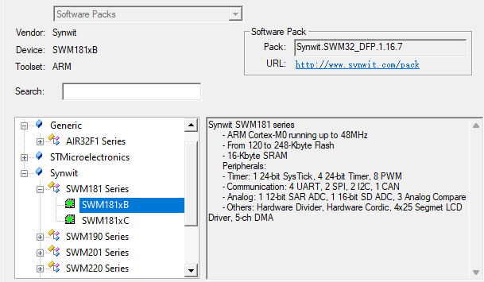
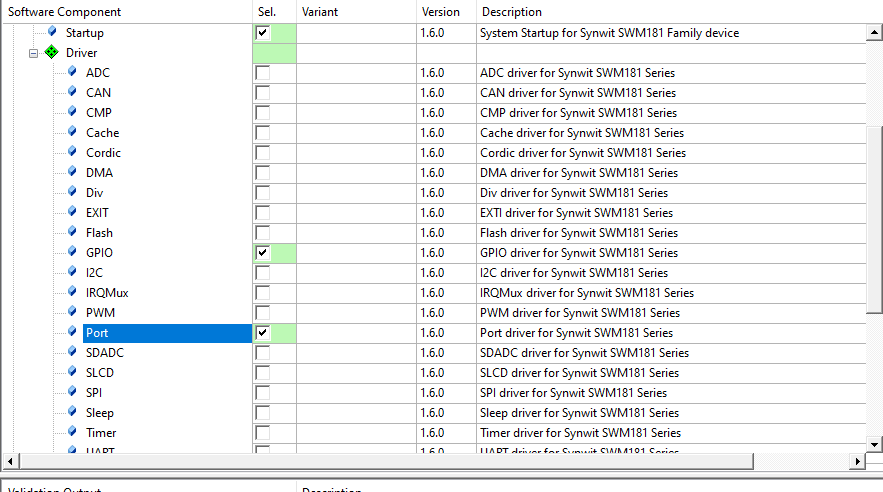
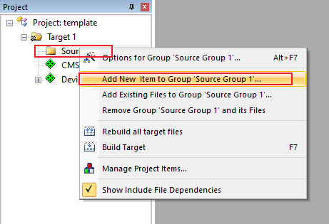
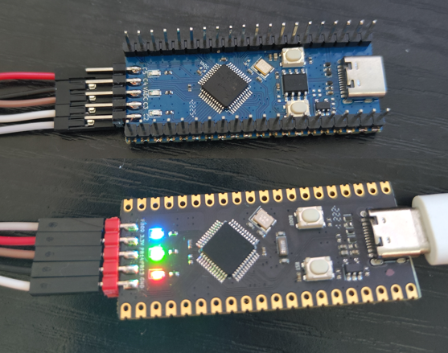
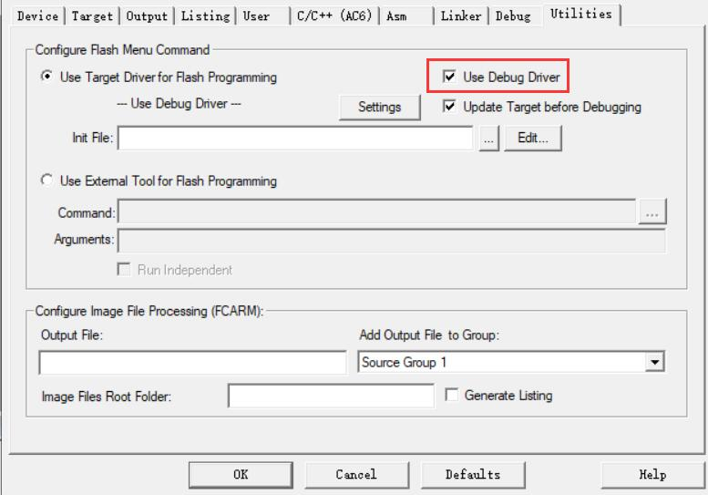
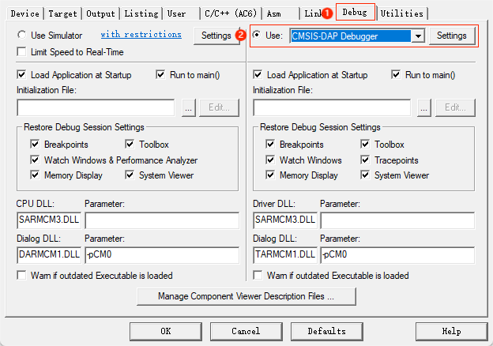
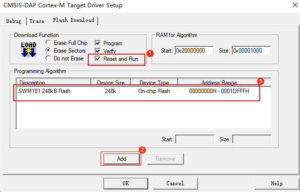

# dhow-to-use-luat-swm181cx

华芯微特 [synwit][https://www.synwit.cn/]：[Datasheet][https://www.synwit.cn/shujushouce/]，[Example][https://www.synwit.cn/kuhanshu_amp_licheng/]，[DevBoard][https://www.synwit.cn/kaifaban/]

### 开始使用 Start to use

#### 环境搭建

1. 安装`MDK5`并激活
2. 安装`pack`包

#### MDK 简单使用


1. 编译

2. 重新编译
3. 烧录
4. 项目配置
5. 文件管理
6. 外设配置
7. 包管理工具

#### 新建项目


选择保存位置：


选择目标设备：



勾选启动文件：


添加外设库支持（按需添加）：



#### 测试代码

右键添加文件：



添加 `.c` 文件：


点灯代码：

```c
#include "SWM181.h"
int main(void){	
	SystemInit();	
	GPIO_Init(GPIOD, PIN0, 1, 0, 0, 0);	//输出，接LED	
	SysTick_Config(SystemCoreClock/4);	//每0.25秒钟触发一次中断			
	while(1==1){}
}

void SysTick_Handler(void){	
	GPIO_InvBit(GPIOD, PIN0);	//反转LED亮灭状态
}
```

设置报错级别：


编译项目：


#### 连接调试器

使用 `air32f103cbt6` 开发板（出厂默认固件为 `daplink`）进行下载烧录 。

注：win7 系统不自带 winusb 驱动，若要使用 DAPLINK 功能，则需安装[驱动][https://zadig.akeo.ie/]。

* AIR32f103 的引脚功能：

| Pin  | Func         |
| ---- | ------------ |
| PB13 | SWD_CLK      |
| PB14 | SWD_DIO      |
| PB0  | RST 复位     |
| PA2  | 虚拟串口的TX |
| PA3  | 虚拟串口的RX |

* 调试器与被调试设备的接线

| air32f103 | swm181  |
| --------- | ------- |
| PB13      | SWD_CLK |
| PB14      | SWD_DIO |
| PB0       | RST     |



#### 烧录程序



选择 `CMSIS-DAP Debugger` ：



调整时钟以提高下载速度：


勾选自动复位：

（每次下载完成时自动复位运行代码，就不需手动复位了）



配置完成后，烧录即可。